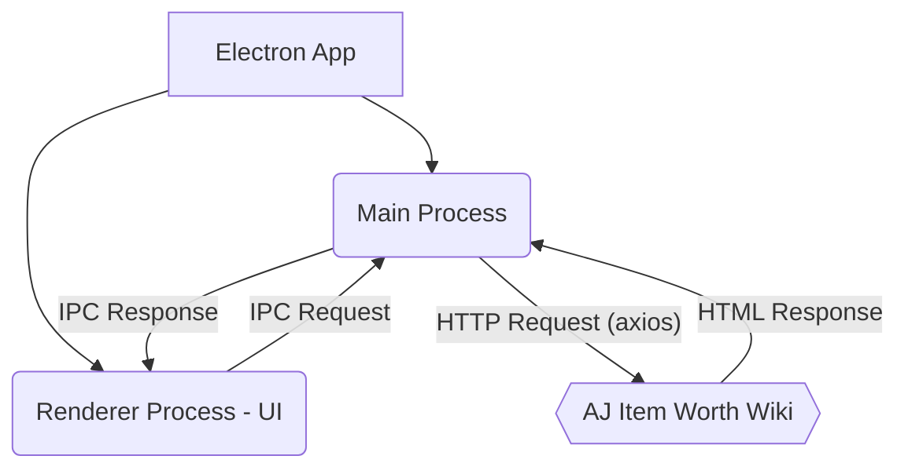

# System Patterns: AJ Item Price Checker

## Architecture Overview (Updated 2025-04-02)

The application now follows an **integrated Electron architecture**, where both the frontend UI and the backend scraping logic reside within the same Electron application process structure.

*   **Electron App:** The single packaged application (`.exe`).
*   **Main Process (`main.js`):** Runs Node.js. Handles window creation, application lifecycle, and contains the backend web scraping logic (using `axios` and `cheerio`). Performs network requests to the external wiki.
*   **Renderer Process (`renderer.js`):** Runs the user interface (HTML/CSS/JS) within a Chromium window. Handles user input and displays results.
*   **Inter-Process Communication (IPC):** The Renderer process sends requests (e.g., search term, page URL) to the Main process via Electron's IPC channels. The Main process performs the scraping and sends the results (or errors) back to the Renderer process via IPC.
*   **External Service:** The Animal Jam Item Worth Wiki (`aj-item-worth.fandom.com`), the data source.

## Key Patterns & Decisions

1.  **Integrated Backend:** The scraping logic is ported to Node.js and runs directly within the Electron main process, eliminating the need for a separate server process (like Python/Flask).
2.  **IPC for Communication:** Electron's built-in `ipcMain` and `ipcRenderer` modules are used for secure and efficient communication between the frontend (Renderer) and the backend logic (Main). This replaces the previous HTTP API calls.
3.  **Asynchronous Operations (Main Process):** The main process uses `async/await` with `axios` for network requests and potentially for parsing with `cheerio` to avoid blocking the main thread while scraping.
4.  **Web Scraping (Node.js):** Standard Node.js libraries (`axios`, `cheerio`) are used for fetching and parsing HTML from the target wiki. This pattern remains dependent on the wiki's structure.
5.  **Single Process Deployment:** The entire application (UI and backend logic) is packaged into a single executable using `electron-builder`.
6.  **Error Handling:** Errors (network, parsing) are handled within the main process scraping logic and communicated back to the renderer process via IPC for display in the UI.

## Comparison to Previous Architectures

*   **Original (Python/PyQt5):** Monolithic application combining UI and logic.
*   **Intermediate (Electron + Python API):** Decoupled UI and backend, but required running two separate processes and used HTTP for local communication.
*   **Current (Integrated Electron):** Combines UI and backend logic within Electron's process model, using IPC for internal communication. Simplifies deployment to a single executable but requires rewriting the backend logic in Node.js.
